## Affine Sets

Any set that contains entire line (not just line segment) is an affine set eg. $$C \subseteq \mathbb{R}^n$$ is an affine set

we can check if a set is affine or not by passing a line between 2 points and interpolate(also extrapolate) between them as long as they reside in the same set i.e, $\theta x_1 + (1-\theta)x_2 \in C$. where the coefficient sum to 1.

    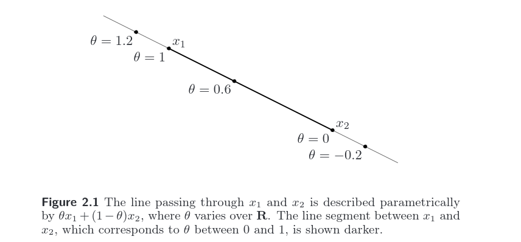

The set of all affine combinations of points in some set $C \subseteq \mathbb{R}^n$ is called the *affine hull* of $C$, and denoted **aff** $C$:

$$ \mathbf{aff}\hspace{2pt} C = \{ \theta_1x_1 + ...... \theta_k x_k| x_1, ......, x_k \in C, \theta_1 + ...... + \theta_k = 1 \}$$

the *affine dimension* of a set $C$ as the dimension of its affine hull.

## Convex Sets

A set $C$ is *convex* if the line segment between any 2 points in $C$ lies in $C$ i.e, if for any $x_1, x_2 \in C$ and any $\theta$ with $0 \leq \theta \leq 1$ we have:

$$\theta x_1 + (1-\theta)x_2$$

    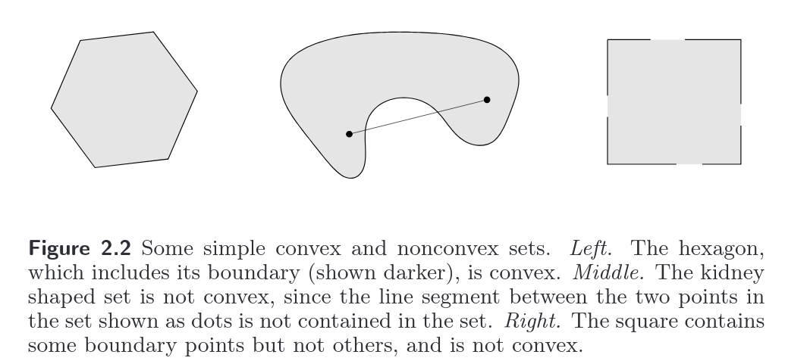

The convex hull of a set $C$, dentoed **conv** $C$, is the set of all convex combinations of points in $C$:

$$ \mathbf{conv}\hspace{2pt} C = \{ \theta_1x_1 + ...... \theta_k x_k| x_1 \in C, \theta_i \geq 0,i=1,....,k, \theta_1 + ...... + \theta_k = 1 \}$$

    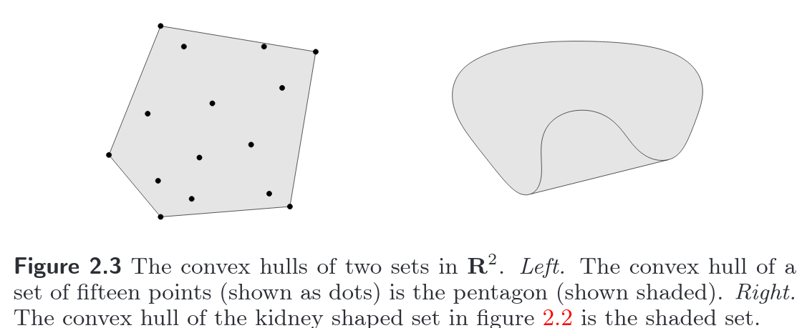

## Cones

    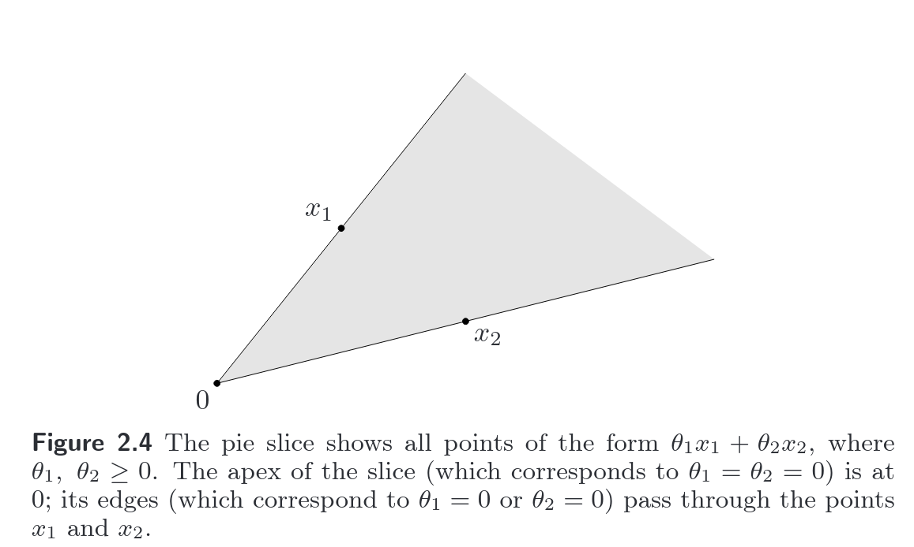
    <i>something</i>

    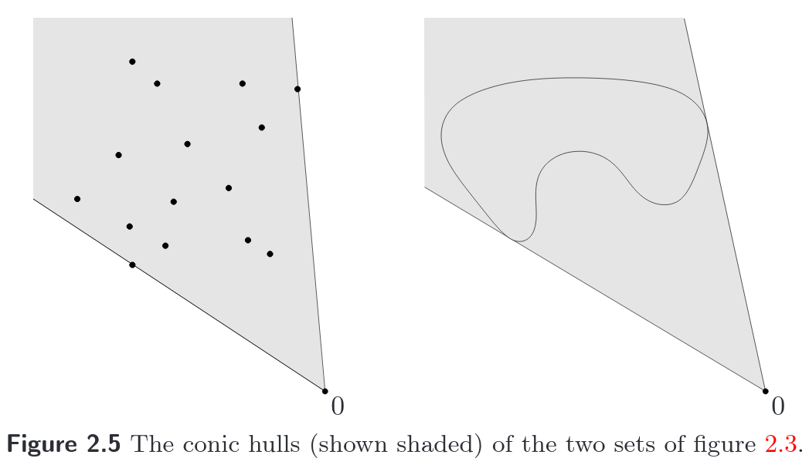
    <i>something</i>

A set $C$ is called a *cone*, or *nonnegative homogneous*, if for every $x \in C$ and $\theta \geq 0$ we have $\theta x \in C$. A set $C$ is a *convex cone* if it is convex and a cone, which means that for any $x_1, x_2 \in C$ and $\theta_1, \theta_2 \geq 0$, we have 

$$\theta_1 x_1 + \theta_2 x_2 \in C$$

A point of the form $\theta_1 x_1 + ... + \theta_k x_k$ with $\theta_1,....,\theta_k \geq 0$ is called a *conic combination* of $x_1,....,x_k$.

The *conic hull* of a set $C$ is the set of all conic combinations of points in $C$, i.e, 

$$ \{ \theta_1x_1 + ...... \theta_k x_k| x_1 \in C, \theta_i \geq 0,i=1,....,k \}$$

example:
### Positive definate Cone

some notations:

$S^n$ represents a symmetric $n\times n$ matrices
$$\{X \in \mathbb{R}^{n \times n} | X = X^T\}$$

$S_+^n$ denotes a symmetric positive semi-definite matrices in $\mathbb{R}^n$ i.e,
$$\{X \in S| X \geq 0\}$$
$S_{++}^n$ denotes a symmetric positive definite matrices in $\mathbb{R}^n$ i.e,
$$\{X \in S| X > 0\}$$

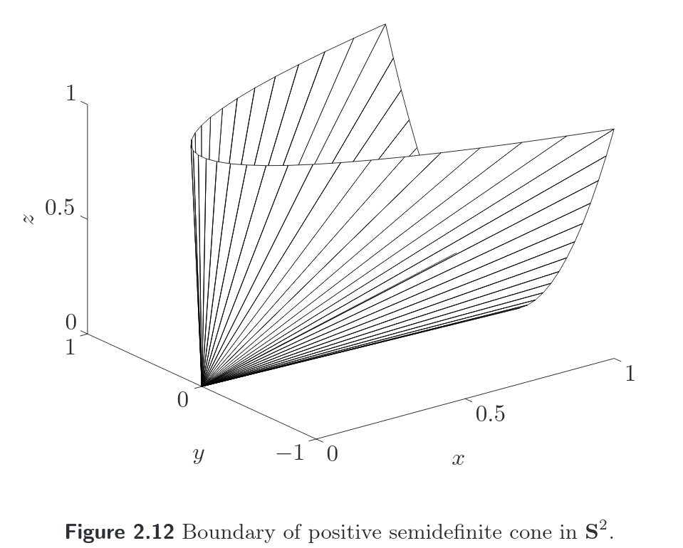

we can verify that this is a convex cone using the above criterion for convex cone:

The set $\mathbf{S}_{+}^{n}$ is a convex cone: if $\theta_{1}, \theta_{2} \geq 0$ and $A, B \in \mathbf{S}_{+}^{n},$ then $\theta_{1} A+\theta_{2} B \in \mathbf{S}_{+}^{n}$
This can be seen directly from the definition of positive semidefiniteness: for any $x \in \mathbf{R}^{n},$ we have
$$
x^{T}\left(\theta_{1} A+\theta_{2} B\right) x=\theta_{1} x^{T} A x+\theta_{2} x^{T} B x \geq 0
$$
if $A \succeq 0, B \succeq 0$ and $\theta_{1}, \theta_{2} \geq 0$

## Hyperplanes

A hyperplane is a set of the form
$$
\left\{x | a^{T} x=b\right\}
$$
where $a \in \mathbf{R}^{n}, a \neq 0,$ and $b \in \mathbf{R} . 

    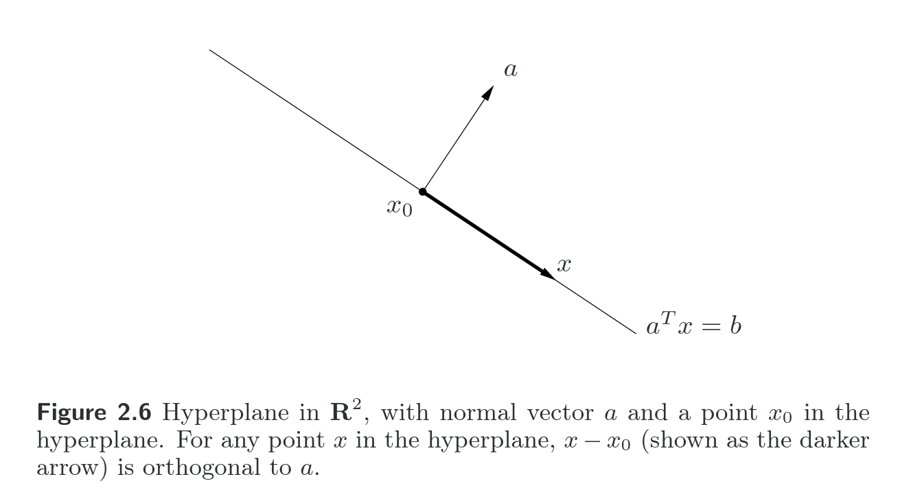
    <i>something</i>

## Halfspace
A (closed) halfspace is a set of the form
$$
\left\{x | a^{T} x \leq b\right\}
$$

    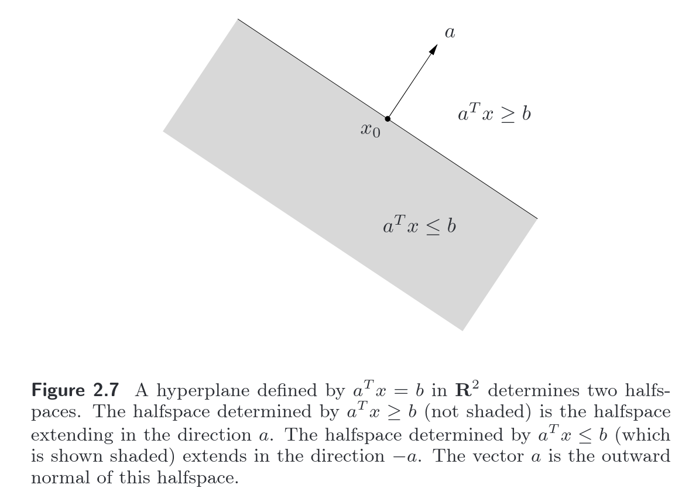
    <i>something</i>

Hyperplane and Halfspaces are really one of the most important concept especially for ML people because everytime you are doing linear classification/regression you are essentially creating a hyperplane which seprates your classes.\
for more indepth and intuitive understanding of hyperplanes you can headover to a blog post I wrote earlier this year.

### Euclidean ball & Norm balls

a set of all points that are inside a ball of radius $r$. i.e,

$$
B\left(x_{c}, r\right)=\left\{x |\left\|x-x_{c}\right\|_{2} \leq r\right\}=\left\{x |\left(x-x_{c}\right)^{T}\left(x-x_{c}\right) \leq r^{2}\right\}
$$

although, euclidean ball on works on L2 norm but you can generalize this concept to encapsulate all the norms, this concept is known as Norm balls i.e,

$$\{x| ||x-x_c|| \leq r\}$$

which is convex.

### Norm cones

    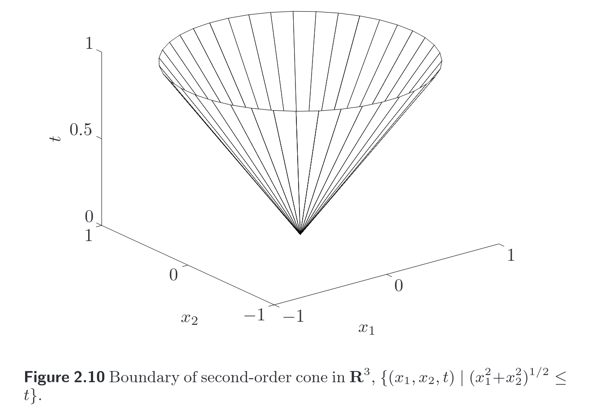

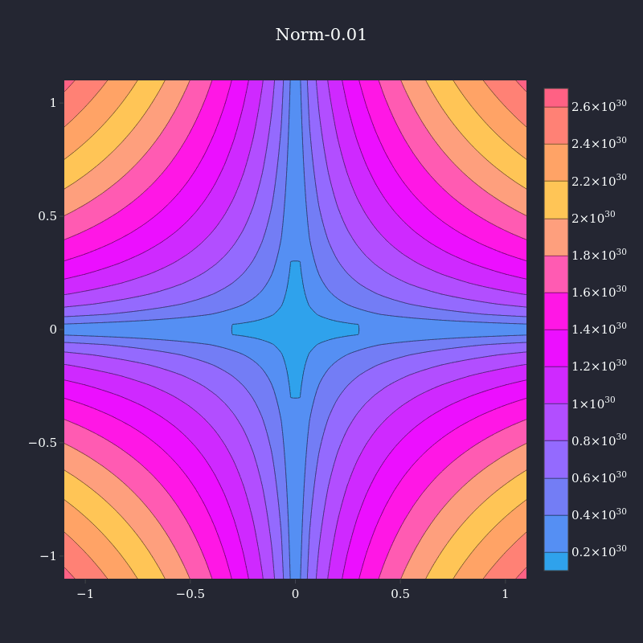

 contour plot of Norm cones, from 1.01 to inf norm

essentially, if we view $n$ dimensional contour plots of norm in $n+1$ dimensions, we essentially get a norm cone.
$$
C=\{(x, t)\hspace{2pt} |\hspace{2pt}\|x\| \leq t\} \subseteq \mathbf{R}^{n+1}
$$

### Ellipsoids

$$\{x\hspace{2pt}|\hspace{2pt}(x-x_c)^TP^{-1}(x-x_c) \leq 1\ $$
another common representation of ellipsoid involves a symmetric and positive definite matrix $A$ :

$$
\{ x_c + Au \hspace{2pt}|\hspace{2pt} \|u\|_2 \leq 1 \}
$$

    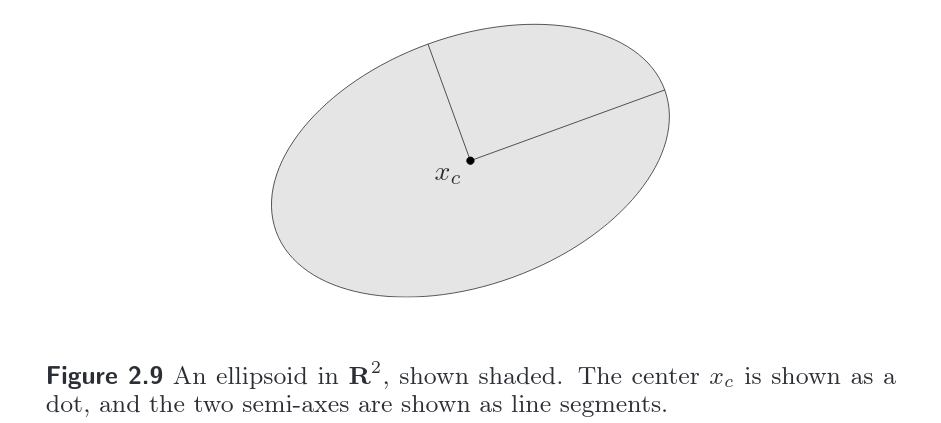
    <i>something</i>

## Polyhedra

A polyhedron is just the intersection of a finite number of halfspaces and hyperplanes

    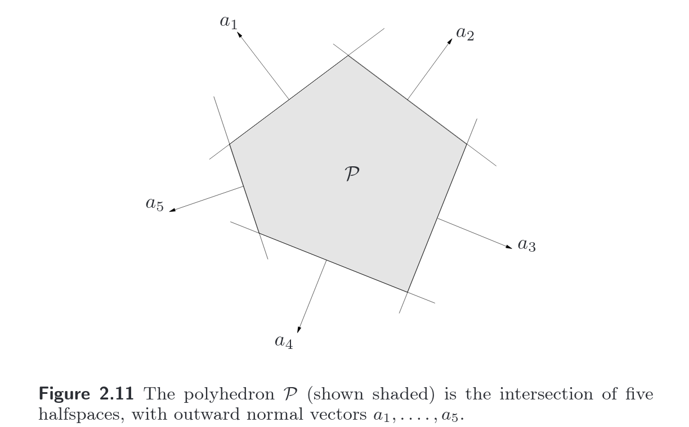
    <i>something</i>

A bounded polyhedra is sometimes called a **polytope**.

## Simplxes

Suppose the k+1 points v_0,.....,v_k \in \mathbb{R}^k are linearly independent. the simplex determined by them is given by

$$ C = \mathbf{conv}\{v_0,....,v_k\} = \{ \theta_0v_0 + ...... + \theta_kv_k | \theta \geq 0, \mathbf{1}^T\theta = 1 \}$$

for e.g let k = 2 which means we have $k+1$ points, $x_1,x_2,x_3$ respectively. Now  by follow above defination, our simplex will look like this :-

 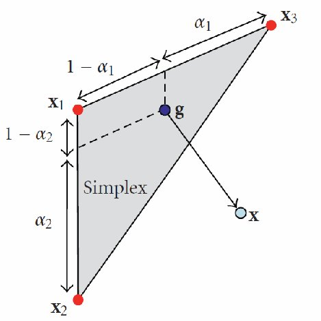

<i>source:<a href="https://www.researchgate.net/figure/Visualization-of-the-geometry-of-the-update-from-a-simplex-in-3D-The-simplex-based-on_fig1_311575791"> Research Gate</a></i>

fun-fact : this linear combination is sometimes known as bany-centric coordiante system.

here are some other simplexes:-

 

<i>source:<a href="https://en.wikipedia.org/wiki/Simplex#/media/File:Simplexes.jpg"> wiki</a></i>

## Operations that preserve convexity

### Intersection

Convexity is preserved under intersection: if $S_1$ and $S_2$ are convex, then $S_1 \cap S_2$ is also convex. for example, a polyhedron is the intersection of halfspaces and hyperplanes (which are convex) and therefore is convex (see fig2.11 above)

### Affine functions

as we saw earlier a linear/Affine function, linearly transform a matrix in $R^n \rightarrow R^m$ and its of the form $f(x) = Ax+b$ where, $A\in \mathbb{R}^{m \times n}$ and $b\in \mathbb{R}^m$

which essentially means that if we scale/stretch or translate a matrix $S$, its convexity is preserved. convexity is also closed under the projection of a convex set onto some of its coordinates and sum of 2 convex sets is convex. more formally,

$$
\alpha S=\{\alpha x | x \in S\}, \quad S+a=\{x+a | x \in S\}
$$
The projection of a convex set onto some of its coordinates is convex: if $S \subseteq$ $\mathbf{R}^{m} \times \mathbf{R}^{n}$ is convex, then
$$
T=\left\{x_{1} \in \mathbf{R}^{m} |\left(x_{1}, x_{2}\right) \in S \text { for some } x_{2} \in \mathbf{R}^{n}\right\}
$$
is convex. The sum of two convex sets is Convex. defined as
$$
S_{1}+S_{2}=\left\{x+y | x \in S_{1}, y \in S_{2}\right\}
$$
We can also consider the *partial sum* of $S_{1}, S_{2} \in \mathbf{R}^{n} \times \mathbf{R}^{m},$ defined as
$$
S=\left\{\left(x, y_{1}+y_{2}\right) |\left(x, y_{1}\right) \in S_{1},\left(x, y_{2}\right) \in S_{2}\right\}
$$
where $x \in \mathbf{R}^{n}$ and $y_{i} \in \mathbf{R}^{m} .$ For $m=0,$ the partial sum gives the intersection of $S_{1}$ and $S_{2} ;$ for $n=0,$ it is set addition. Partial sums of convex sets are convex (see exercise $2.16)$

## Linear-fraction and perspective functions

suppose we have a vector $v = [x_1,x_2,x_3]$ now, if we just divide all the components of $v$ by $x_3$ we get $[x_1/x_3,x_2/x_3,1]$ which we can rewrite it as $[x_1/x_3,x_2/x_3]$. here, we essentially reduce our vector in $R^3 \rightarrow R^n$ by dividing all the components by the last component and then drop the last component (because its just a constant $1$) more formally, 

we define the perspective function $P: R^{n + 1} \rightarrow \mathbf{R}^n$, with domain $\mathbf{dom}\hspace{2pt} P = \mathbf{R}^n \times R_{++}$, as $P(z,t) = z/t$. The perspective function scales or normalizes vectors so the last component is one, and then drops the last component.

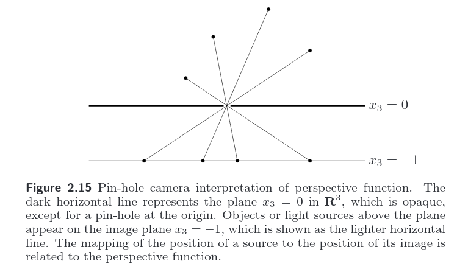

## Proper Cone

A cone $K \subset \mathbb{R}^n$ is called a proper cone if it satisfies the following:

* $K$ is convex.
* $K$ is closed(i.e, it includes its boundry points as well).
* $K$ is solid, which means it has nonempty interior.
* $K$ is pointed, which means that it contains no line.

## Generalized inequalities

In higher dimensions, we can't really say that a vector $x \leq y$ 
or $x \leq y$ for all the vectors in $\mathbb{R}^n$ for e.g. lets take 2 vectors in $\mathbb{R}^2$

$$
\begin{bmatrix}
1 \\
3\\
\end{bmatrix}
\nleq
\begin{bmatrix}
4 \\
2\\
\end{bmatrix}\hspace{.1in}
or\hspace{.1in}
\begin{bmatrix}
1 \\
3\\
\end{bmatrix}
\ngeq
\begin{bmatrix}
4 \\
2\\
\end{bmatrix}
$$

here, we can see that although, $1$ is less then $4$ but on the second row $3$ is not less then $2$ becuse they don't compare in linear ordering like we can do in $\mathbf{R}$ so we can't really compare them using the usual less then and greater then sense.
thats where *generalized inequality* comes in.

we can define a generalized inequality with respect to a proper cone $K$, which induce a partial ordering on $\mathbf{R}^n$ that has many of the properties of the standard ordering on $R$. this can be represented as follow:

$$ x \preceq y \Longleftrightarrow y -x \in K$$

which we sometimes refer to non-strict generalized inequality.

we also write $x\preceq_K y$ for $y\preceq_K x$. Similarly, we defined an associated strict partiial ordering by 
$$ x \prec_K y \Longleftrightarrow y-x \in \mathbf{int}\hspace{1pt}K$$

### componentwise inequality

as the name suggest, this compares 2 vector in element wise manner i.e, $x_i \geq y_i, i=1,...,n$ for e.g.
lets compare 2 vector with respect to the proper cone, nonngeative orthant $K=\mathbf{R}_{++}^n$ as follows:
$$
\begin{bmatrix}
1 \\
2\\
5\\
\end{bmatrix}
<
\begin{bmatrix}
3 \\
4\\
9\\
\end{bmatrix}
$$

notice here we used $<$ instead of $\prec$ becuase the generalized inequality w.r.t nonngeative orthant  $\prec_{\mathbf{R}_{++}^n}$ arise so frequently that we drop the subscript $\mathbf{R}_{++}^n$; it is understood when the symbol $\preceq$ or $\prec$ appears between vectors.

### matrix inequality

the associated generalized inequality w.r.t  positive semidefinate cone $K = \mathbf{S}_+^n$ is the usual matrix inequality i.e, 
$$ X,Y\in S_+^n | X \preceq_K Y \Longleftrightarrow Y - X \in S_+^n$$

here too, the partial oedering arises so frequently that we drop the subscript: for symmertic matrixes we weite simply $X \preceq X$ or $X \prec Y$. It is understood that the generalized inequalities are with respect to the positive semidefinite cone.

## Properties of generalized inequalites

Properties of generalized inequalities
A generalized inequality $\preceq K$ satisfies many properties, such as

$\bullet \preceq \kappa$ is preserved under addition: if $x \preceq \kappa y$ and $u \preceq \kappa v,$ then $x+u \preceq \kappa y+v$

$\bullet \preceq K$ is trunsitive: if $x \preceq \kappa y$ and $y \preceq K z$ then $x \preceq K z$

$\bullet \leq \kappa$ is preserved under nonnegative scaling: if $x \leq K y$ and $\alpha \geq 0$ then
$$
\alpha x \preceq k \alpha y
$$

$\bullet \preceq k$ is reflexive: $x \preceq k x$

$\bullet \leq K$ is antisymmetric: if $x \preceq K y$ and $y \preceq K x,$ then $x=y$

$\bullet \leq \kappa$ is preserved under limits: if $x_{i} \preceq \kappa y_{i}$ for $i=1,2, \ldots, x_{i} \rightarrow x$ and $y_{i} \rightarrow y$
$$
\text { as } i \rightarrow \infty, \text { then } x \preceq \kappa y
$$

The corresponding strict generalized inequality $\prec_{K}$ satisfies, for example,

$\bullet$ if $x \prec K y$ then $x \preceq K y$

$\bullet$ if $x \prec K y$ and $u \preceq \kappa v$ then $x+u \prec K y+v$

$\bullet$ if $x \prec K y$ and $\alpha>0$ then $\alpha x \prec K \alpha y$

$\bullet x \nprec K x$

if $x \prec K y,$ then for $u$ and $v$ small enough, $x+u \prec K y+v$
These properties are inherited from the definitions of $\preceq \kappa$ and $\prec K,$ and the properties of proper cones.

## Minimum and minimal elements

we say that $x \in S$ is the **minimum** element of $S$ (with respect to the generalized inequality $\preceq_{K}$) if for *every* $y \in S$ we have $x \preceq_K y$. if a set has a minimum/mximum element then it is unique. more formally, A point $x \in S$ is a minimal element if and only if 
$$ S\subseteq x + K$$

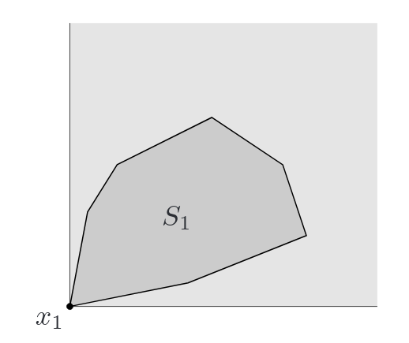

<i>set $S_{1}$ has a minimum element $x_{1}$ with respect to componentwise inequality in $\mathbf{R}^{2} .$ The set $x_{1}+K$ is shaded lightly; $x_{1}$ is the minimum element of $S_{1}$ since $S_{1} \subseteq x_{1}+K .$ 
</i>

for e.g.

whereas, **minimal** element is not unique. we say that $x \in S$ is a minimal elment of $S$ (w.r.t generalized inequality). if no other point $y$ is better then $x$ but there are points $y$ that are as good as $x$, more formally, A point $x \in S$ is a minimal element if and only if 
$$ (x-K) \cap S = \{ x\}$$

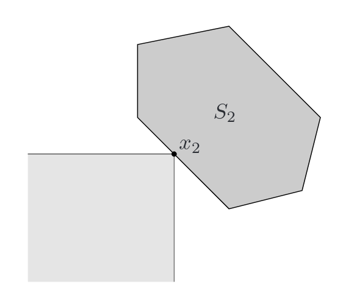

<i>The point $x_{2}$ is a minimal point of $S_{2}$. The set $x_{2}-K$ is shown lightly shaded. The point $x_{2}$ is minimal because $x_{2}-K$ and $\bar{S}_{2}$ intersect only at $x_{2}$</i>

## Seperating hyperplane

### seperating hyperplane theorem
Suppose $C$ and $D$ are nonempty disjoint convex sets, $i . e ., C \cap D=\emptyset .$ Then there exist $a \neq 0$ and $b$ such that $a^{T} x \leq b$ for all $x \in C$ and $a^{T} x \geq b$ for all $x \in D .$ In other words, the affine function $a^{T} x-b$ is nonpositive on $C$ and nonnegative on $D .$ The hyperplane $\left\{x | a^{T} x=b\right\}$ is called a separating hyperplane for the sets $C$ and $D,$ or is said to separate the sets $C$ and $D .$ This is illustrated in figure.

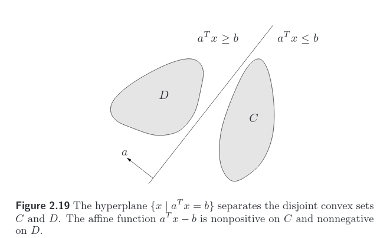

## Supporting hyperplanes

### supporting hyperplane theorem

the supporting hyperplane theorem, states that for any nonempty convex set $C,$ and any $x_{0} \in$ bd $C,$ there exists a supporting hyperplane to $C$ at $x_{0} .$

if hyperplane that is on the boundry point $x_0$ of the set $C$ (i.e, $x_0 \in \mathbf{bd}C$) whose halfspace encolsed the entire set then it is said to be a supporting hyperplane.

## Dual cones and generalized inequalities

a point $y$ belongs to the dual cone $K^*$ if and only if $-y$ is the normal of a hyperplane that supports the original cone $K$ at the origin. i.e,

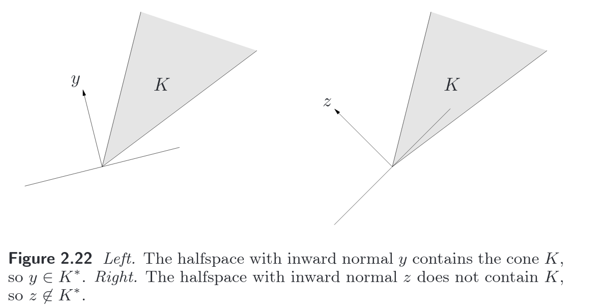

More formally,

Let $K$ be a cone. The set

$$ K^* = \{ y | x^Ty \geq 0 \hspace{2pt}\text{for all}\hspace{2pt} x \in K$$

is called **dual cone** of $K$. the dual cone is always convex, even when the original cone $K$ is not.

Properties of dual cone:

* $K^{*}$ is closed and convex.

* $K_{1} \subseteq K_{2}$ implies $K_{2} \subseteq K_{1}^{*}$

* If $K$ has nonempty interior, then $K^{*}$ is pointed.

* If the closure of $K$ is pointed then $K^{*}$, honempty interior.

* $K^{* *}$ is the closure of the convex hull of $K .$ (Hence if $K$ is convex and closed,\left.K^{* *}=K .\right)$

some important properties relating a generalized inequality and its dual are

* $x \preceq \kappa y$ if and only if $\lambda^{T} x \leq \lambda^{T} y$ for all $\lambda \succeq \kappa \cdot 0$

* $x \prec \kappa y$ if and only if $\lambda^{T} x<\lambda^{T} y$ for all $\lambda \succeq \kappa \cdot 0, \lambda \neq 0$