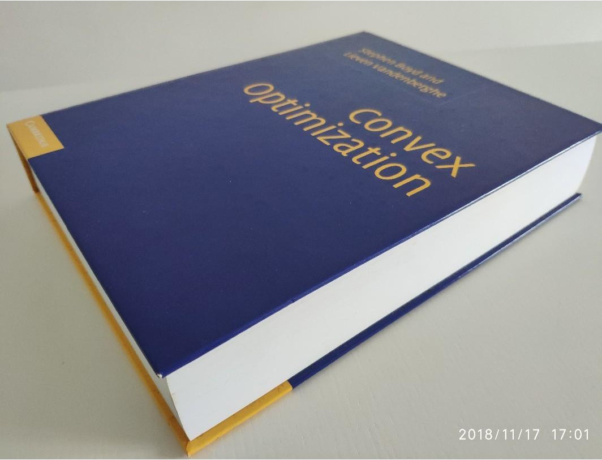

## Convex Optimization Book

source: <a href="https://sg.carousell.com/p/convex-optimization-stephen-boyd-lieven-vandenberghe-200347223/">carousell.com</a>

So, the book is divided into 3 parts, 

* Part I : Theory/Analysis
* Part II : Application
* Part III : Implementation

Before looking at the notes lets take a high-level view over each of the parts of this beautiful book

* Part I gives you an introduction to the facinating world of covex optimization, it first go over what are convex sets and how to tell the difference between convex and non-convex using jensen's inquality then it go over generalized inequality which essentially generalize all the concepts reguarding the 1-d convex optimization into mutliple dimensions. in chapter 3 we will first forumlate convex optimization problems and understand what are convex functions and what are some of the operations which when applied to these functions would still gives us a convex function for example if we take the summation of 2 convex-function the resulatant set will be convex. we also looked at another import concept called cojugate functions which gives us the lower bound over our original convex functions we will also touch this concept of lower bound in the last chapter of part I in which, we will talk about the dual function and duality. chapter 4 introduces us the different types of convex optimization problems like Second-order cone programming(LP), linear programming (LP), geometric programming (GP), some of which may not be convex in its natural formulation but can be cast to convex optimization problems which can then be solved using different convex optimizaiton package, one of which is the CVXPY which we will use it in our interactive notebook...

* Part II focuses on the Application of all the theory we have read in the Part I of this book. here, we first look at how to use convex optimization to solve curve fitting/ regression problems (in some sense), one of the techinques that really intrigue me is the concept of Huber-panelty function which we will use to define many robust approximation models in the next chapter we will go throught MLE and MAP estimation from the perspective of statistics as well as convex optimization we also looked at the hypothesis testing and how to formulate our assumptions into cvx problem lastly we looked at 2 of the most important bounds in statistical estimation Chebyshev and Chernoff bounds. in chapter 8 we looked at different geometric problems like analytic centric ( which is used in almost every field), classification (we will also look at QDE and even SVM!) lastly, we will look at the problem of floor planning which essientally finds best dimensions of each of the rooms given the maximum dimension of the land, this techinques is also being used in VLSI design(circuit design) inwhich we have to design the circuit using the resources as optimally as possible..

* Part III go over some of the most important algorithm which are the workhorses behind these covex optimization packages like CVXOPT, CVXPY, APOPT etc in chapter 9 we looked at several gradient based methods to solve unconstrained minimiztion problems like our good o'l  gradient descent and also looked at methods which uses second order methods like newton's methods etc. we also looked at the theory of self concordence which helps us to analyse newton's method also the method we will look at in later chapters, in chpater 10 we again use newton's method to solve equality constaint minimization problem we also looked at some of the implementation details which might prove useful if you are using this to create your own library or wanna understand how other library implements these concepts... lastly, in the final chapter we looked at on of the most important method in the modern convex optimization litrature is the concept of interior point method which helps us to solve the inequality constriant minimization problem by recursively solving the equaltiy constraint problem using the method called 'barrier method' although one might agruge that the explaination of interior-point methods isn't complete enough in this book but more like an introduction and that would be correct so please don't take this chapter as end all be all of this methods (if you want to dive deep into this concept then i really like this <a href="https://www.amazon.in/Numerical-Optimization-Jorge-Nocedal/dp/0387303030" >book by Nocedal & Wright</a>. by the way, there is also a <a href="https://youtu.be/7CMWdO5dgdQ">video</a> about it which you might find useful while going thorugh that book ) also, one more thing, i bet by the end of this chapter you will start respecting the least-sqares methods again.. :D

* Chapter 1 : Introduction ( doesn't need Notes)
* <a href="ConvexOptimization/Ch2.ipynb">Chapter 2 : Convex Set</a>
* <a href="ConvexOptimization/Ch3.ipynb">Chapter 3 : Convex Function</a>
* 
* <a href="ConvexOptimization/Ch5.ipynb">Chapter 5 : Duality</a>